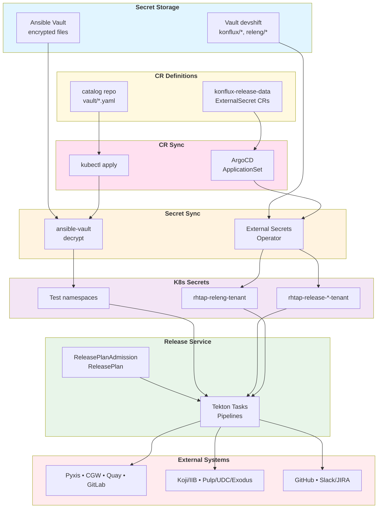

# Release Service Secrets Inventory

> **Related JIRA**: [RELEASE-2070](https://issues.redhat.com/browse/RELEASE-2070) - Create comprehensive doc and flow-chart related to release Secrets

This document consolidates comprehensive information about all secrets used by the Konflux Release Service, including:
- Where secrets are stored (Vault paths)
- Where secrets are used (tasks, pipelines, data keys)
- Who owns each secret (teams responsible for rotation)
- Expiry dates and rotation procedures
- Design patterns and lifecycle flows

**Scope**: Covers secrets from `release-service-catalog`, `release-service-utils`, `internal-services`, `release-service`, and `konflux-release-data` repositories.

**Format note**: Main tables are kept compact with rotation details moved to an appendix for better readability.

## Flowchart: Secret Lifecycle and Design Patterns

This flowchart visualizes how secrets flow from storage to consumption across different systems.



### Design Patterns Identified

1. **Managed secrets via ArgoCD pattern** (blue → yellow → pink → orange → purple → green):
   - Vault (`konflux/*` paths) → ExternalSecret CR in `konflux-release-data` → ArgoCD syncs CR to cluster → ESO fetches from Vault → K8s Secret (managed namespace) → ReleasePlanAdmission → Task
   - Used for: Pyxis, CGW, Pulp, IIB, advisory/errata
   - Managed by: Release Service team, credentials owned by external service teams
   - SecretStore: ClusterSecretStore `appsre-stonesoup-vault`

2. **Tenant secrets via ArgoCD pattern**:
   - Vault (`releng/*` paths) → ExternalSecret CR in `konflux-release-data` → ArgoCD syncs CR to cluster → ESO fetches from Vault → K8s Secret (tenant namespace) → ReleasePlan → Task
   - Used for: Slack notifications, e2e test credentials
   - Managed by: Release Service team, tenant configures usage in ReleasePlan
   - SecretStore: SecretStore `releng-vault`

3. **Integration test secrets pattern**:
   - Ansible Vault encrypted files in catalog repo → Manual `kubectl apply` → ansible-vault decrypt → K8s Secret (test namespace) → Test Pipeline
   - Used for: E2E tests, integration tests
   - Managed by: Konflux Releng team

4. **Multi-environment pattern**:
   - Same secret name, different Vault paths per environment (stage/prod/qa)
   - ExternalSecret CRs in different cluster directories in `konflux-release-data`
   - Used for: Pyxis, CGW, Pulp, UDC, advisory, IIB
   - Managed via environment-specific ArgoCD Applications

5. **Hybrid auth pattern**:
   - Single Vault path contains multiple auth credentials (username/password + token)
   - Example: CGW has both `CGW_USERNAME`/`CGW_PASSWORD` and `CGW_TOKEN`
   - Tasks consume based on API endpoint requirements

### Key Observations

- **GitOps-driven secret management**: Most secrets follow a GitOps pattern where ExternalSecret CRs in `konflux-release-data` are synced by ArgoCD, then ESO fetches actual secrets from Vault
- **Credential ownership fragmentation**: Credentials owned by different teams (Pyxis, CGW, Quay, GitLab, etc.) requiring coordinated rotation with Release Service
- **Mixed expiry models**: Some secrets expire (certs), some don't (tokens), some are rotated on-demand
- **Namespace complexity**: Secrets span multiple namespaces (managed vs tenant) with different access patterns and SecretStore configurations
- **Two-stage sync**: Secrets require both CR sync (ArgoCD) and secret value sync (ESO) before becoming available to Release Service

## Canonical data keys (Release data)
| Data key | Purpose | Where used (examples) | Vault path(s) | Credential Owner |
| --- | --- | --- | --- | --- |
| `cgw.cgwSecret` | Content Gateway auth (username/token) | `tasks/managed/create-advisory`, `pipelines/internal/push-artifacts-to-cdn`, `pipelines/internal/push-disk-images` | `konflux/release/internal-services/content-gateway/prod/content-gateway-service-account` | Content Gateway team |
| `github.githubSecret` | GitHub token for releases | `tasks/managed/create-github-release` | `konflux/release/github/release-service-bot` | GitHub org admin |
| `pyxis.secret` | Pyxis cert/key pair | `tasks/managed/*pyxis*` | `konflux/release/pyxis/stage`, `konflux/release/pyxis/prod` | Pyxis team |
| `sign.cosignSecretName` | Cosign AWS and signing key | `tasks/managed/rh-sign-image-cosign` | `secrets/konflux/release/cosign` | Signing service |
| `slack.slack-notification-secret` | Slack webhook secret | `tasks/managed/send-slack-notification` | `releng/konflux/rhtap-releng-tenant/common/release-team-slack-webhook-notification-secret` | Slack admin |
| `mapping.registrySecret` | Quay.io API token | `tasks/managed/make-repo-public` | staging/release/quay/hacbs-release-tests_iib-pub<br>production/release/quay/rh-osbs__iib-pub<br>production/release/quay/rh-osbs__rhtap_preview_iib | Quay admin (Tim Waugh) |

## Task and pipeline secrets (catalog)
| Secret param | Where used | Vault path(s) | Credential Owner |
| --- | --- | --- | --- |
| `pyxisSecret` | `tasks/managed/*pyxis*` | `konflux/release/pyxis/stage`, `konflux/release/pyxis/prod` | Pyxis team |
| `githubSecret` | `tasks/managed/create-github-release` | `konflux/release/github/release-service-bot` | GitHub admin |
| `cgwSecret` | `tasks/managed/create-advisory`, `pipelines/internal/push-artifacts-to-cdn`, `pipelines/internal/push-disk-images` | `konflux/release/internal-services/content-gateway/prod/content-gateway-service-account` | CGW owner |
| `PULP_SECRET_NAME` | `tasks/managed/push-rpms-to-pulp` | `konflux/release/internal-services/rhsm-pulp/prod/certificate`, `konflux/release/internal-services/rhsm-pulp/stage/certificate`, `konflux/release/internal-services/rhsm-pulp/qa/certificate` | Pulp team |
| `iibServiceAccountSecret` | `pipelines/internal/update-fbc-catalog`, `pipelines/internal/check-fbc-opt-in`, `tasks/managed/add-fbc-contribution` | `staging/release/iib/iib-service-account`, `production/release/iib/iib-service-account` | IIB team |
| `publishingCredentials` | `pipelines/internal/*fbc*`, `tasks/internal/update-fbc-catalog-task` | `staging/release/quay/hacbs-release-tests_iib-pub`, `production/release/fbc/publishing-credentials`, `production/release/fbc/publishing-credentials-redhat-prod`, `hacbs-internal-services/fbc/preview/publishing-credentials` | Quay admin (Tim Waugh) |
| `registrySecret` | `tasks/managed/make-repo-public` | staging/release/quay/hacbs-release-tests_iib-pub<br>production/release/quay/rh-osbs__iib-pub<br>production/release/quay/rh-osbs__rhtap_preview_iib | Quay admin (Tim Waugh) |
| `secretName` + `secretKeyName` | `tasks/managed/send-slack-notification` | `releng/konflux/rhtap-releng-tenant/common/release-team-slack-webhook-notification-secret` | Slack admin |
| `file_updates_secret` | `pipelines/internal/process-file-updates` | `staging/release/gitlab/gitlab.cee/file-updates-secret`, `production/release/gitlab/gitlab.cee/file-updates-secret` | GitLab admin |
| `advisory_secret_name` | `pipelines/internal/create-advisory`, `pipelines/internal/filter-already-released-advisory-images` | `konflux/release/internal-services/gitlab/gitlab.cee/create-advisory-prod-secret`, `konflux/release/internal-services/gitlab/gitlab.cee/create-advisory-stage-secret` | GitLab admin |
| `errata_secret_name` | `pipelines/internal/create-advisory` | `konflux/release/internal-services/errata/prod/errata-service-account`, `konflux/release/internal-services/errata/stage/errata-service-account` | Errata team |
| `exodusGwSecret` | `pipelines/internal/push-artifacts-to-cdn`, `pipelines/internal/push-disk-images` | `konflux/release/internal-services/exodus/prod/certificates`, `konflux/release/internal-services/exodus/nonprod/certificates` | Exodus GW team |
| `pulpSecret` | `pipelines/internal/push-artifacts-to-cdn`, `pipelines/internal/push-disk-images` | `konflux/release/internal-services/rhsm-pulp/prod/certificate`, `konflux/release/internal-services/rhsm-pulp/stage/certificate`, `konflux/release/internal-services/rhsm-pulp/qa/certificate` | Pulp team |
| `udcacheSecret` | `pipelines/internal/push-artifacts-to-cdn`, `pipelines/internal/push-disk-images` | `konflux/release/internal-services/udcache/prod/certificate`, `konflux/release/internal-services/udcache/stage/certificate`, `konflux/release/internal-services/udcache/qa/certificate` | UDC team |

## Additional vault paths from CSV

Secrets documented in the CSV but not directly referenced in catalog tasks (used by internal services, automation, or infrastructure):

| Vault path | Purpose | Credential Owner | Expiry/Status |
| --- | --- | --- | --- |
| `staging/release/gitlab/gitlab.cee/managed-tenants` | MRs in rhtap-release/managed-tenants-stage | GitLab admin | Used; RHTAPREL-682 |
| `staging/release/registry-io-pull` | Pull secret for registry.redhat.io | Registry admin | Used in dev-release-team-tenant; RHTAPREL-686 |
| `production/release/gitlab/gitlab.cee/managed-tenants` | MRs in service/managed-tenants | GitLab admin | Used=FALSE; new |
| `production/release/ldap/konflux-release-gitlab-bot` | LDAP service account (username, password, snow_reference) | LDAP admin | Used=FALSE; new |
| `stonesoup/production/release/quay/konflux-release-service-access-management` | Quay app for repo access management | Quay admin (Ralph Bean) | Used=FALSE; KONFLUX-4437 |
| `konflux/release/umb/nonprod/umb-certificates` | UMB nonprod crt and key files | UMB team | Expires Jan 8 2027 |
| `konflux/release/umb/nonprod/umb-service-account` | UMB nonprod service account (id, password) | UMB team | Rotation not required |
| `konflux/release/umb/prod/umb-certificates` | UMB prod crt and key files | UMB team | Expires Jan 8 2027 |
| `konflux/release/umb/prod/umb-service-account` | UMB prod service account (id, password) | UMB team | Rotation not required |
| `konflux/release/internal-services/exodus/prod/exodus-service-account` | Exodus prod service account + password | Exodus team | Rotate per CLOUDDST-22185 |
| `konflux/release/internal-services/exodus/nonprod/exodus-service-account` | Exodus nonprod service account + password | Exodus team | Rotate per CLOUDDST-22185 |
| `konflux/release/internal-services/content-gateway/prod/content-gateway-service-account-read-only` | CGW read-only prod service account | CGW team | Generate via CGW webUI |
| `konflux/release/internal-services/osidb/prod/osidb-service-account` | OSIDB Kerberos service account | OSIDB team | Rotate via ServiceNow |
| `konflux/release/quay/prod/redhat-workloads-token` | Pull token for konflux-ci/redhat-workloads | Quay admin (Ralph Bean) | Used in internal-services |
| `konflux/release/internal-services/signing-servers/prod/konflux-release-signing-sa` | Service account for publishing signed binaries to developer portal | Signing team | Rotate via ServiceNow (CLDX-77) |
| `konflux/release/quay/prod/konflux-artifacts` | Sharing OCI artifacts between Konflux and signing hosts | Quay admin (swickers/bhills/pkhander) | Managed by swickers/bhills/pkhander |
| `konflux/release/registry.redhat.io` | Pull secret for building release-utils in Konflux | Registry admin | Generate at access.redhat.com |
| `hacbs/hacbs-internal-services/internal-services-controller/remote-client-config/hacbs-dev` | Kubeconfig for hacbs-dev cluster | Cluster admin | Version 9; RHTAPREL-690 |
| `hacbs/hacbs-internal-services/internal-services-controller/remote-client-config/staging-p01` | Kubeconfig for staging-p01 cluster | Cluster admin | Used=FALSE |
| `hacbs/hacbs-internal-services/internal-services-controller/remote-client-config/stonesoup-prod` | Kubeconfig for stonesoup-prod cluster | Cluster admin | Version 5; RHTAPREL-707 |

## Related repos (quick inventory)
| Secret/env | Where used | Vault path(s) | Credential Owner |
| --- | --- | --- | --- |
| `CGW_USERNAME` + `CGW_PASSWORD` | `release-service-utils` CGW wrappers | `konflux/release/internal-services/content-gateway/prod/content-gateway-service-account` | CGW team |
| `CGW_TOKEN` + `CGW_HOST` | `release-service-utils` CGW scripts | `konflux/release/internal-services/content-gateway/prod/content-gateway-service-account` | CGW team |
| `PYXIS_CERT_PATH` + `PYXIS_KEY_PATH` | `release-service-utils/pyxis/*` | `konflux/release/pyxis/stage`, `konflux/release/pyxis/prod` | Pyxis team |
| `PYXIS_GRAPHQL_API` | `release-service-utils/pyxis/*` | `konflux/release/pyxis/stage`, `konflux/release/pyxis/prod` | Pyxis team |
| `GITHUB_TOKEN` | `release-service-utils` promote overlay | `konflux/release/github/release-service-bot` | GitHub admin |
| `ACCESS_TOKEN` | `release-service-utils` git helpers | `staging/release/gitlab/gitlab.cee/file-updates-secret`, `production/release/gitlab/gitlab.cee/file-updates-secret` | GitLab admin |
| `internal-service-request-service-account-secret` | `release-service-utils` kubeconfig helper | `hacbs/hacbs-internal-services/internal-services-controller/remote-client-config/*` | Cluster admin |

## Integration tests (release-service-catalog)

These secrets are used by e2e and integration test pipelines in the catalog:

| Secret param/name | Purpose | Vault path(s) | Credential Owner |
| --- | --- | --- | --- |
| `redhat-appstudio-registry-pull-secret` | Pull images from docker.io/quay.io in build PipelineRun | Default after cluster provision | Konflux Releng |
| `hacbs-release-tests-token` | Pull/push images from quay.io in managed PipelineRun | staging: dockerconfigjson for hacbs-release-tests+m5_robot_account<br>ephemeral: QUAY_TOKEN env | Konflux Releng |
| `redhat-appstudio-qe-bot-token` | Create releases in GitHub repos | GITHUB_TOKEN env | Konflux Releng |
| `release-tests-token` | Push images to Pyxis staging repo | redhat-pending+rhtap_release_integration2 from Vault | Konflux Releng |
| `test-cosign-secret` | Used by rh_sign_cosign task | `secrets/konflux/release/cosign` (yuzheng provided, jluza provided PUBLIC_KEY) | Konflux Releng |
| `file-updates-secret` | Used by run-file-updates task | Token for https://gitlab.cee.redhat.com/hacbs-qe/app-interface | Konflux Releng |
| `publish-to-cgw-secret` | Used by publish-to-cgw task | `secrets/konflux/release/internal-services/content-gateway` (created by pkhander/swickers) | Konflux Releng |
| `exodus-prod-secret` | Used by push-to-cdn task | `secrets/konflux/release/internal-services/exodus/prod/certificates` (created by pkhander/swickers) | Konflux Releng |

## ExternalSecrets (konflux-release-data)
| ExternalSecret | Vault key | Namespace | SecretStore | Credential Owner |
| --- | --- | --- | --- | --- |
| `e2e-test-vault-password-secret` | `stonesoup/staging/release/e2e/vault-password` | `rhtap-release-2-tenant` | `appsre-stonesoup-vault` (ClusterSecretStore) | Konflux Releng |
| `e2e-test-service-account-kubeconfig` | `stonesoup/staging/release/e2e/e2e-test-service-account-kubeconfig` | `rhtap-release-2-tenant` | `appsre-stonesoup-vault` (ClusterSecretStore) | Konflux Releng |
| `e2e-test-github-token` | `stonesoup/staging/release/e2e/e2e-base-github-token` | `rhtap-release-2-tenant` | `appsre-stonesoup-vault` (ClusterSecretStore) | Konflux Releng |
| `release-team-slack-webhook-notification-secret` | `releng/konflux/rhtap-releng-tenant/common/release-team-slack-webhook-notification-secret` | `rhtap-releng-tenant` | `releng-vault` (SecretStore) | Konflux Releng |

## Appendix: Rotation details

Detailed rotation procedures for secrets with explicit guidance.

**Common ServiceNow forms**:
- General support / password reset: https://redhat.service-now.com/help?id=sc_cat_item&sys_id=ec649e491bc74d587f9bfc8f034bcbe3
- Service catalog: https://redhat.service-now.com/help?id=rh_service_catalog

---

### Pyxis cert/key (stage/prod)
**Vault paths**: `konflux/release/pyxis/stage`, `konflux/release/pyxis/prod`  
**Expiry**: January 17, 2027  
**JIRA**: RHTAPREL-894

**Rotation procedure**:
1. See Pyxis access request procedure at https://issues.redhat.com/browse/RHTAPREL-627
2. Use `service-account-credentials` found as key in Vault
3. Once new certificate is created, add it to Vault as new version
4. Propagate to RemoteSecrets (see "Adding a Secret to a Managed Workspace" guide)
5. Revoke the old certificate:
   - Determine the serial number:
     ```bash
     openssl x509 -in hacbs-release-pyxis.crt -noout -text | grep 'Serial Number'
     ```
   - Note the item in brackets (e.g., 0xffe15d7)
   - Go to https://redhat.service-now.com/ and click "Support Services" at top right, or go directly to https://redhat.service-now.com/help?id=rh_service_catalog
   - Click "Request General Support" at bottom left
   - Select IT
   - "Is there a service degradation?" → No
   - "Select the app" → RHCS
   - "Are you requesting something new?" → New
   - Enter body: "Please revoke the following certificates.\n- 0xffe15d7 (← change this)"

**Note**: When the Service Account name is changed, you must notify the CLOUDWF team via a ticket (see example: CLOUDWF-10575)

---

### Content Gateway service account
**Vault path**: `konflux/release/internal-services/content-gateway/prod/content-gateway-service-account`  
**Expiry**: No expiry

**Rotation procedure**:
Generate new token from webUI at: https://source.redhat.com/groups/public/dxp/exd_digital_experience_platforms_dxp_blog/user_tokens_now_available_in_content_gateway

---

### Quay robot tokens (all environments)
**Vault paths**: Multiple (see tables above)  
**Expiry**: No expiry  
**JIRA**: RHTAPREL-685, RHTAPREL-694-702, etc.

**Rotation procedure**:
Contact Tim Waugh to request rotation using the "RHTAP - SP Robot Rotation" process.

**Alternative for specific tokens**:
- For `hacbs-release-tests_iib-pub`: Create new robot account in Quay (add increasing suffix)
- For managed by team: `swickers`, `bhills`, or `pkhander` can update/rotate directly from Quay org

---

### IIB service account (stage/prod)
**Vault paths**: `staging/release/iib/iib-service-account`, `production/release/iib/iib-service-account`  
**Expiry**: No expiry  
**JIRA**: RHTAPREL-685 (stage), new (prod)

**Rotation procedure**:
1. Request new ServiceAccount (new numbered suffix) and keytab via ServiceNow (see form above)
2. Create MR to update this section in the catalog
3. Once MR is merged, update app-interface with a MR
4. Then create new ServiceNow ticket (same form) asking to delete old Service Account

---

### GitLab access tokens (file-updates)
**Vault paths**: `staging/release/gitlab/gitlab.cee/file-updates-secret`, `production/release/gitlab/gitlab.cee/file-updates-secret`  
**Expiry**: No expiry  
**JIRA**: RHTAPREL-682 (stage), RHTAPREL-687 (prod)

**Rotation procedure**:

**For staging** (`hacbs-release-tests/app-interface`):
1. Go to https://gitlab.cee.redhat.com/hacbs-release-tests/app-interface/-/settings/access_tokens
2. Note the Scopes
3. Create new token with required scopes

**For production** (`rhtap-release/app-interface`):
1. Go to https://gitlab.cee.redhat.com/rhtap-release/app-interface/-/settings/access_tokens
2. Note the Scopes
3. Create new token with required scopes

---

### GitLab managed-tenants tokens
**Vault paths**: `staging/release/gitlab/gitlab.cee/managed-tenants`, `production/release/gitlab/gitlab.cee/managed-tenants`  
**Expiry**: No expiry  
**JIRA**: RHTAPREL-682 (stage), new (prod)

**Rotation procedure**:

**For staging** (`rhtap-release/managed-tenants-stage`):
1. Go to https://gitlab.cee.redhat.com/groups/rhtap-release/-/settings/access_tokens
2. Find the `stage-konflux-release-addons` token
3. Note the Scopes
4. Click rotate and copy the secret

**For production** (`service/managed-tenants`):
1. Login using LDAP account `konflux-release-gitlab-bot`
2. Go to https://gitlab.cee.redhat.com/-/user_settings/personal_access_tokens
3. Note the Scopes
4. Create new token with required scopes

---

### Advisory GitLab tokens (stage/prod)
**Vault paths**: `konflux/release/internal-services/gitlab/gitlab.cee/create-advisory-stage-secret`, `konflux/release/internal-services/gitlab/gitlab.cee/create-advisory-prod-secret`  
**Expiry**: January 13, 2027

**Rotation procedure**:

**For production** (`releng/advisories`):
1. Go to https://gitlab.cee.redhat.com/releng/advisories/-/settings/access_tokens
2. Create new token with name `release-service-token-MMDDYYYY`
3. Set role: Developer
4. Set scopes: `read_repository` + `write_repository`

**For staging** (`rhtap-release/advisories`):
1. Go to https://gitlab.cee.redhat.com/rhtap-release/advisories/-/settings/access_tokens
2. Create new token with name `release-service-token-MMDDYYYY`
3. Set role: Developer
4. Set scopes: `read_repository` + `write_repository`

---

### Pulp certificates (prod/stage/qa)
**Vault paths**: `konflux/release/internal-services/rhsm-pulp/{prod,stage,qa}/certificate`  
**Expiry**: Jun 11, 2026  
**JIRA**: RHELDST-25044

**Rotation procedure**:
Follow the rotation steps detailed in https://issues.redhat.com/browse/RHELDST-25044

**Contains**: cert, key, and url for accessing pulp in the pulp_push_wrapper script

---

### UDCache certificates (prod/stage/qa)
**Vault paths**: `konflux/release/internal-services/udcache/{prod,stage,qa}/certificate`  
**Expiry**: Jun 11, 2026  
**JIRA**: TEAMNADO-7368

**Rotation procedure**:
Follow the rotation steps detailed in https://issues.redhat.com/browse/TEAMNADO-7368

**Contains**: cert, key, and url for flushing udcache instance in the pulp_push_wrapper script

---

### Exodus certificates (prod/nonprod)
**Vault paths**: `konflux/release/internal-services/exodus/prod/certificates`, `konflux/release/internal-services/exodus/nonprod/certificates`  
**Expiry**: March 29, 2026  
**JIRA**: CLOUDDST-22187 (prod), CLOUDDST-22185 (nonprod)

**Rotation procedure**:
Follow the rotation steps detailed in:
- Production: https://issues.redhat.com/browse/CLOUDDST-22187
- Nonprod: https://issues.redhat.com/browse/CLOUDDST-22185

---

### Exodus service accounts (prod/nonprod)
**Vault paths**: `konflux/release/internal-services/exodus/prod/exodus-service-account`, `konflux/release/internal-services/exodus/nonprod/exodus-service-account`  
**Expiry**: No expiry  
**JIRA**: CLOUDDST-22185

**Rotation procedure**:
Follow the rotation steps detailed in https://issues.redhat.com/browse/CLOUDDST-22185

---

### Errata service accounts (prod/stage)
**Vault paths**: `konflux/release/internal-services/errata/prod/errata-service-account`, `konflux/release/internal-services/errata/stage/errata-service-account`  
**Expiry**: No expiry

**Rotation procedure**:
Submit password reset request via ServiceNow form: https://redhat.service-now.com/help?id=sc_cat_item&sys_id=ec649e491bc74d587f9bfc8f034bcbe3

**Purpose**: Used for obtaining a Kerberos ticket as our errata service account and communicating with the errata API

---

### OSIDB service account
**Vault path**: `konflux/release/internal-services/osidb/prod/osidb-service-account`  
**Expiry**: No expiry

**Rotation procedure**:
Submit password reset request via ServiceNow form: https://redhat.service-now.com/help?id=sc_cat_item&sys_id=ec649e491bc74d587f9bfc8f034bcbe3

**Purpose**: Used for obtaining a Kerberos ticket as our osidb service account and communicating with the osidb API

---

### UMB certificates (prod/nonprod)
**Vault paths**: `konflux/release/umb/prod/umb-certificates`, `konflux/release/umb/nonprod/umb-certificates`  
**Expiry**: January 8, 2027

**Rotation procedure**:
Follow the UMB Client Guide to generate new client cert

**Contains**: crt and key files

**Note**: UMB service accounts (id and password) do NOT require rotation

---

### Kubeconfig files (remote-client-config)
**Vault paths**: `hacbs/hacbs-internal-services/internal-services-controller/remote-client-config/{hacbs-dev,staging-p01,stonesoup-prod}`  
**Expiry**: No expiry  
**JIRA**: RHTAPREL-690 (hacbs-dev), RHTAPREL-707 (stonesoup-prod)

**Rotation procedure**:
1. Re-run `get-kubeconfig-from-service-account.sh`
2. Copy file to clipboard
3. Create new version in Vault

---

### registry.redhat.io pull secrets
**Vault paths**: `staging/release/registry-io-pull`, `konflux/release/registry.redhat.io`  
**Expiry**: No expiry  
**JIRA**: RHTAPREL-686 (stage)

**Rotation procedure**:

**For staging**:
1. Regenerate token at https://access.redhat.com/terms-based-registry/token/stonesoup
2. Go to the "Openshift Secret" tab
3. Copy the `.dockerconfigjson` value
4. Update Vault

**For production**:
Generate new password at https://access.redhat.com/terms-based-registry/#/

---

### FBC publishing credentials
**Vault paths**: `production/release/fbc/publishing-credentials`, `production/release/fbc/publishing-credentials-redhat-prod`, `hacbs-internal-services/fbc/preview/publishing-credentials`  
**Expiry**: No expiry  
**JIRA**: RHTAPREL-700 (prod), RHTAPREL-698 (preview)

**Rotation procedure**:
Contact Tim Waugh to request rotation via "RHTAP - SP Robot Rotation" process

**Contains**:
- `sourceIndexCredential` with value `rh-osbs+rhtap_fbc_release_prod:<token>` (or similar)
- `targetIndexCredential` with value `redhat+rhtap_fbc_release_prod:<token>` (or similar)

---

### LDAP konflux-release-gitlab-bot
**Vault path**: `production/release/ldap/konflux-release-gitlab-bot`  
**Expiry**: No expiry

**Rotation procedure**:
Submit password reset request via ServiceNow form: https://redhat.service-now.com/help?id=sc_cat_item&sys_id=ec649e491bc74d587f9bfc8f034bcbe3

**Contains**: username, password, and snow_reference  
**Purpose**: Used as GitLab bot. Login using the username/password and generate access tokens

---

### Signing server service account
**Vault path**: `konflux/release/internal-services/signing-servers/prod/konflux-release-signing-sa`  
**Expiry**: No expiry  
**JIRA**: CLDX-77

**Rotation procedure**:
Submit a ServiceNow request to IT asking to rotate the password

**Purpose**: Service account for publishing signed binaries to developer portal

---

### GitHub release-service-bot
**Vault path**: `konflux/release/github/release-service-bot`  
**Expiry**: No expiry

**Contains**: email, password, and recovery keys for https://github.com/release-service-bot

**Purpose**: Used in catalog promotion script and internal-services final pipeline

---

## Out of scope - managed by other teams

The following secrets have incomplete information (Vault path and/or expiry set to TBD) and are managed by other teams:

| Name | Secret | Where used | Credential Owner | Repository |
| --- | --- | --- | --- | --- |
| MRRC AWS | `mrrc.awsSecret` | `tasks/managed/publish-to-mrrc` | MRRC team | release-service-catalog |
| OOT kmods signing | `ootsign.signing-secret` / `signing-secret` | `tasks/managed/sign-oot-kmods` | Signing team | release-service-catalog |
| OOT kmods checksum fingerprint | `ootsign.checksumFingerprint` / `checksumFingerprint` | `tasks/managed/sign-oot-kmods` | Signing team | release-service-catalog |
| OOT kmods checksum keytab | `ootsign.checksumKeytab` / `checksumKeytab` | `tasks/managed/sign-oot-kmods` | Signing team | release-service-catalog |
| Koji push keytab | `pushOptions.pushKeytab.secret` / `pushSecret` | `tasks/managed/push-rpm-to-koji`, `tasks/managed/promote-koji-draft-build`, `tasks/managed/update-package-collection` | Koji team | release-service-catalog |
| Git token (OOT kmods) | `git.tokenSecret` / `gitTokenSecret` | `tasks/managed/push-oot-kmods-to-git` | Git host admin | release-service-catalog |
| S3 credentials | `s3.credentialsSecret` / `s3CredentialsSecret` | `tasks/managed/push-oot-kmods-to-s3` | S3 owner | release-service-catalog |
| Azure Service Principal | `azure.spSecret` | Tasks not in this repo (placeholder) | Azure owner | External (TBD) |
| JIRA Advisory | `jira.jiraAdvisorySecret` / `jiraSecretName` | `tasks/managed/populate-release-notes` | JIRA admin | release-service-catalog |
| Infra PR Creator | `infra.prCreatorSecret` / `sharedSecret` | `tasks/managed/update-infra-deployments` | infra-deployments owner | release-service-catalog |
| Atlas SSO | `atlas.atlas-sso-secret-name` | `tasks/managed/collect-atlas-params` | Atlas team | release-service-catalog |
| Atlas Retry AWS | `atlas.atlas-retry-aws-secret-name` | `tasks/managed/collect-atlas-params` | Atlas team | release-service-catalog |
| Cloud Marketplaces | `mapping.cloudMarketplacesSecret` / `cloudMarketplacesSecret` | `tasks/managed/marketplacesvm-push-disk-images` | Cloud marketplace team | release-service-catalog |
| Konflux test infra (internal-services) | `konflux-test-infra-secret` / `cloud-credential-key` / `cluster-access-secret` / `remote-cluster-access-secret` / `local-cluster-access-secret` / `mapt-kind-secret` | `internal-services` e2e pipeline | Konflux Releng | internal-services |
| Konflux test infra (release-service) | `konflux-test-infra-secret` / `mapt-kind-secret` / `cluster-access-secret-name` / `konflux-e2e-secrets` | `release-service` e2e pipeline | Konflux Releng | release-service |

**Note**: These secrets are referenced in the catalog but lack complete documentation. They are managed by other teams and are out of scope for Release Team secret management.

---

## Data sources

This document was compiled from:
1. **Code analysis**: `release-service-catalog`, `release-service-utils`, `internal-services`, `release-service` repositories
2. **Schema**: `schema/dataKeys.json` for canonical data keys
3. **Configuration**: `konflux-release-data` repository for ExternalSecret definitions
4. **CSV inventory**: `Release-Service-Secrets.csv` for Vault paths, expiry dates, rotation procedures, and JIRA trackers
5. **Documentation**: Integration test READMEs and maintenance guides

